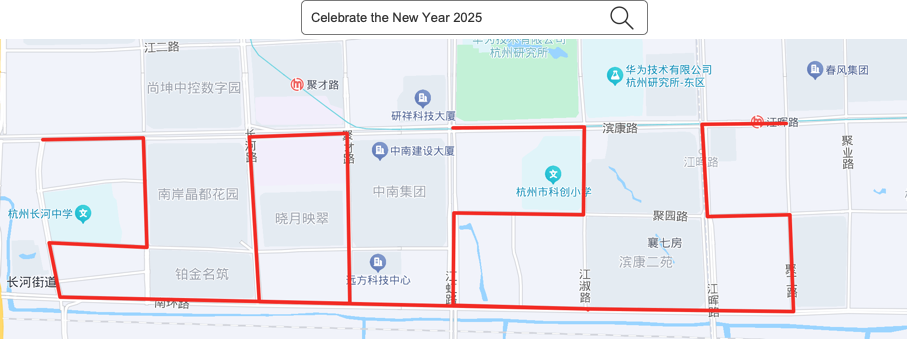
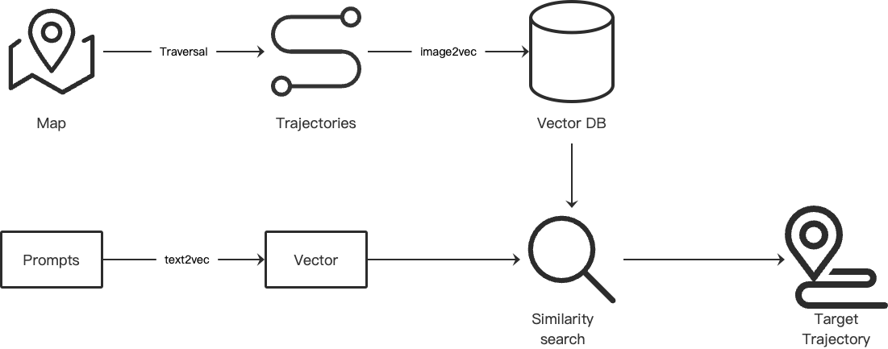

# TrailArt
[中文](README_zh.md)


## Introduction
TrailArt: Generate a route on the map based on the prompt words

## Expected results
Enter the prompt words, and the system will generate a related route on the map. People can walk along it and generate a walking trajectory.



## Architecture



## Setup

### 1.Clone source code
```
git clone https://github.com/sunmh207/trail-art.git
cd trail-art
```

### 2.  Install dependent packages
```
pip install -r requirements.txt
```

### 3.  Run
```
python app.py
```
Select the action number to be performed

1.Traverse all the paths on the map, generate images and save them in the data/routes directory.

2.Read the images in data/routes, convert them into vectors, and store them in the local vector database (location: data/faiss).

3.Find the most suitable route image based on the prompt word.

You need to execute in order.
## Notes
**This is just an experimental project. It only provides an idea and basic code. It has not yet achieved the expected results. Everyone is welcome to provide comments and suggestions.**