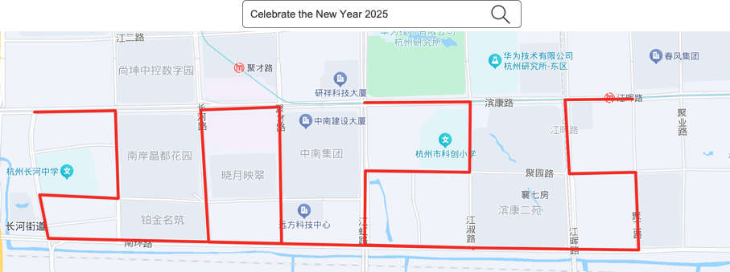

# TrailArt
[English](README.md)

## 介绍
TrailArt：根据提示词在地图上生成路线

## 预期结果
输入提示词，系统会在地图上生成相关路线，人们可以沿着它行走，并生成行走轨迹。



## 架构图


## 设置

### 1.克隆源代码
```
git clone https://github.com/sunmh207/trail-art.git
cd trail-art
```

### 2. 安装依赖包
```
pip install -r requirements.txt
```

### 3. 运行
```
python app.py
```
选择要执行的操作编号

1.遍历地图上的所有路径，生成图片并保存在data/routes目录下。

2.读取data/routes中的图片，将其转化为矢量，并存储在本地矢量数据库中（位置：data/faiss）。

3.根据提示词找到最合适的路径图片.

需要按顺序执行。

## 注意事项
**这只是一个实验项目，只提供了一个思路和基本代码，还没有达到预期的效果，欢迎大家提供意见和建议。**